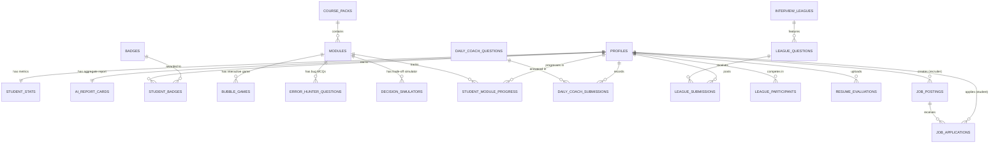

# Database Schema & Data Models — AIgnite
> **Project**: AIgnite (*pronounced ignite, 'A' is silent*)  
> **Database Engine**: PostgreSQL 16 (Hosted on Supabase)  
> **Extensions**: `uuid-ossp`, `pgcrypto`, `vector` (pgvector)  

---

## 1. Entity-Relationship Overview



---

## 2. PostgreSQL DDL SQL & Schema Definitions

```sql
-- Enable necessary extensions
CREATE EXTENSION IF NOT EXISTS "uuid-ossp";
CREATE EXTENSION IF NOT EXISTS "pgcrypto";
CREATE EXTENSION IF NOT EXISTS "vector";

-- Enums
CREATE TYPE user_role AS ENUM ('student', 'recruiter', 'admin');
CREATE TYPE league_tier AS ('bronze', 'silver', 'gold', 'llm_master', 'ai_architect');
CREATE TYPE module_track AS ('gen_ai', 'machine_learning', 'deep_learning', 'nlp', 'computer_vision');
CREATE TYPE module_status AS ('not_started', 'in_progress', 'completed');
CREATE TYPE application_status AS ('applied', 'reviewing', 'interview_scheduled', 'shortlisted', 'rejected');

-- ==============================================================================
-- 1. PROFILES & ROLES
-- ==============================================================================
CREATE TABLE public.profiles (
    id UUID PRIMARY KEY REFERENCES auth.users(id) ON DELETE CASCADE,
    role user_role NOT NULL DEFAULT 'student',
    full_name TEXT NOT NULL,
    username TEXT UNIQUE NOT NULL,
    avatar_url TEXT,
    headline TEXT,
    bio TEXT,
    github_url TEXT,
    linkedin_url TEXT,
    portfolio_url TEXT,
    region TEXT DEFAULT 'India',
    college_or_company TEXT,
    is_verified BOOLEAN DEFAULT FALSE,
    fcm_token TEXT,
    default_mobile_landing_page TEXT NOT NULL DEFAULT 'feed', -- 'feed', 'dashboard', 'coach', 'league'
    default_web_landing_page TEXT NOT NULL DEFAULT 'dashboard', -- 'feed', 'dashboard', 'coach', 'league'
    created_at TIMESTAMPTZ DEFAULT NOW(),
    updated_at TIMESTAMPTZ DEFAULT NOW()
);

-- ==============================================================================
-- 2. STUDENT GAMIFICATION & STREAKS
-- ==============================================================================
CREATE TABLE public.student_stats (
    student_id UUID PRIMARY KEY REFERENCES public.profiles(id) ON DELETE CASCADE,
    total_points INTEGER NOT NULL DEFAULT 0,
    current_streak INTEGER NOT NULL DEFAULT 0,
    highest_streak INTEGER NOT NULL DEFAULT 0,
    last_active_date DATE,
    current_league_tier TEXT NOT NULL DEFAULT 'bronze', -- 'bronze', 'silver', 'gold', 'llm_master', 'ai_architect'
    league_points_this_week INTEGER NOT NULL DEFAULT 0,
    overall_ranking INTEGER,
    regional_ranking INTEGER,
    updated_at TIMESTAMPTZ DEFAULT NOW()
);

-- ==============================================================================
-- 3. AI INTERVIEW REPORT CARD (Aggregated Portfolio)
-- ==============================================================================
CREATE TABLE public.ai_report_cards (
    student_id UUID PRIMARY KEY REFERENCES public.profiles(id) ON DELETE CASCADE,
    knowledge_score NUMERIC(3,1) NOT NULL DEFAULT 0.0,      -- Range 0.0 - 10.0
    confidence_score NUMERIC(3,1) NOT NULL DEFAULT 0.0,     -- Range 0.0 - 10.0
    communication_score NUMERIC(3,1) NOT NULL DEFAULT 0.0,  -- Range 0.0 - 10.0
    examples_score NUMERIC(3,1) NOT NULL DEFAULT 0.0,       -- Range 0.0 - 10.0
    industry_level_score NUMERIC(3,1) NOT NULL DEFAULT 0.0, -- Range 0.0 - 10.0
    total_interviews_completed INTEGER NOT NULL DEFAULT 0,
    strengths TEXT[],
    areas_for_improvement TEXT[],
    ai_summary_feedback TEXT,
    updated_at TIMESTAMPTZ DEFAULT NOW()
);

-- ==============================================================================
-- 4. COURSE PACKS & LEARNING MODULES
-- ==============================================================================
CREATE TABLE public.course_packs (
    id UUID PRIMARY KEY DEFAULT gen_random_uuid(),
    slug TEXT UNIQUE NOT NULL, -- e.g., 'google-ai-pack', 'nvidia-ai-pack'
    title TEXT NOT NULL,
    company_name TEXT NOT NULL, -- 'Google', 'NVIDIA', 'OpenAI', 'Microsoft', 'Amazon'
    description TEXT NOT NULL,
    thumbnail_url TEXT,
    price_inr INTEGER DEFAULT 0,
    is_free BOOLEAN DEFAULT TRUE,
    created_at TIMESTAMPTZ DEFAULT NOW()
);

CREATE TABLE public.modules (
    id UUID PRIMARY KEY DEFAULT gen_random_uuid(),
    pack_id UUID REFERENCES public.course_packs(id) ON DELETE SET NULL,
    track module_track NOT NULL DEFAULT 'gen_ai',
    title TEXT NOT NULL,
    order_index INTEGER NOT NULL DEFAULT 1,
    description TEXT,
    content_markdown TEXT NOT NULL, -- Theory & notes
    created_at TIMESTAMPTZ DEFAULT NOW()
);

-- Module Activity: 1. Bubble Game (Pipeline Builder)
CREATE TABLE public.bubble_games (
    id UUID PRIMARY KEY DEFAULT gen_random_uuid(),
    module_id UUID REFERENCES public.modules(id) ON DELETE CASCADE,
    title TEXT NOT NULL, -- e.g., 'RAG Master Pipeline Builder'
    target_pipeline_type TEXT NOT NULL, -- 'rag', 'fine_tuning', 'agentic_workflow'
    available_nodes JSONB NOT NULL, -- Array of node cards with latency/cost/type
    valid_sequences JSONB NOT NULL, -- Array of acceptable connector sequences
    time_limit_seconds INTEGER DEFAULT 120,
    max_score INTEGER DEFAULT 100
);

-- Module Activity: 2. Error Hunter (Code Bug MCQ)
CREATE TABLE public.error_hunter_questions (
    id UUID PRIMARY KEY DEFAULT gen_random_uuid(),
    module_id UUID REFERENCES public.modules(id) ON DELETE CASCADE,
    code_snippet TEXT NOT NULL,
    language TEXT NOT NULL DEFAULT 'python',
    question_prompt TEXT NOT NULL,
    options JSONB NOT NULL, -- ['Missing zero_grad()', 'Tensor mismatch', 'Wrong learning rate']
    correct_option_index INTEGER NOT NULL,
    explanation TEXT NOT NULL
);

-- Module Activity: 3. Decision Simulator (Tradeoff Scenarios)
CREATE TABLE public.decision_simulators (
    id UUID PRIMARY KEY DEFAULT gen_random_uuid(),
    module_id UUID REFERENCES public.modules(id) ON DELETE CASCADE,
    scenario_title TEXT NOT NULL,
    scenario_context TEXT NOT NULL, -- "10 GB data, GPU available, low latency needed"
    options JSONB NOT NULL, -- Options with model choices
    best_choice_index INTEGER NOT NULL,
    tradeoff_explanations JSONB NOT NULL
);

-- Module Activity: 4. AI Lab (System Architect Sandbox)
CREATE TABLE public.ai_lab_missions (
    id UUID PRIMARY KEY DEFAULT gen_random_uuid(),
    module_id UUID REFERENCES public.modules(id) ON DELETE CASCADE,
    mission_title TEXT NOT NULL, -- e.g. "Build an Enterprise Chatbot"
    mission_objective TEXT NOT NULL,
    configurable_slots JSONB NOT NULL, -- Embedding, Chunk Size, Vector Index, LLM Model
    evaluation_rubric JSONB NOT NULL
);

-- Student Progress Tracking
CREATE TABLE public.student_module_progress (
    id UUID PRIMARY KEY DEFAULT gen_random_uuid(),
    student_id UUID REFERENCES public.profiles(id) ON DELETE CASCADE,
    module_id UUID REFERENCES public.modules(id) ON DELETE CASCADE,
    status module_status NOT NULL DEFAULT 'not_started',
    bubble_game_score INTEGER DEFAULT 0,
    error_hunter_score INTEGER DEFAULT 0,
    decision_simulator_score INTEGER DEFAULT 0,
    ai_lab_score INTEGER DEFAULT 0,
    mock_interview_passed BOOLEAN DEFAULT FALSE,
    completed_at TIMESTAMPTZ,
    UNIQUE(student_id, module_id)
);

-- ==============================================================================
-- 5. DAILY INTERVIEW COACH & HABIT TRACKER
-- ==============================================================================
CREATE TABLE public.daily_coach_questions (
    id UUID PRIMARY KEY DEFAULT gen_random_uuid(),
    for_date DATE UNIQUE NOT NULL,
    topic TEXT NOT NULL, -- e.g., 'Optimization & Gradient Descent'
    question_text TEXT NOT NULL,
    sample_key_points TEXT[] NOT NULL,
    difficulty TEXT DEFAULT 'Intermediate'
);

CREATE TABLE public.daily_coach_submissions (
    id UUID PRIMARY KEY DEFAULT gen_random_uuid(),
    student_id UUID REFERENCES public.profiles(id) ON DELETE CASCADE,
    question_id UUID REFERENCES public.daily_coach_questions(id) ON DELETE CASCADE,
    audio_recording_url TEXT,
    transcript TEXT,
    knowledge_score NUMERIC(3,1) NOT NULL,
    confidence_score NUMERIC(3,1) NOT NULL,
    communication_score NUMERIC(3,1) NOT NULL,
    overall_score NUMERIC(3,1) NOT NULL,
    ai_feedback TEXT NOT NULL,
    created_at TIMESTAMPTZ DEFAULT NOW(),
    UNIQUE(student_id, question_id)
);

-- ==============================================================================
-- 6. AI INTERVIEW LEAGUE 🏆 (Duolingo for AI Interviews)
-- ==============================================================================
CREATE TABLE public.interview_leagues (
    id UUID PRIMARY KEY DEFAULT gen_random_uuid(),
    week_number INTEGER NOT NULL,
    year INTEGER NOT NULL,
    start_date TIMESTAMPTZ NOT NULL,
    end_date TIMESTAMPTZ NOT NULL,
    is_active BOOLEAN DEFAULT TRUE,
    UNIQUE(week_number, year)
);

CREATE TABLE public.league_questions (
    id UUID PRIMARY KEY DEFAULT gen_random_uuid(),
    league_id UUID REFERENCES public.interview_leagues(id) ON DELETE CASCADE,
    question_number INTEGER NOT NULL, -- 1 to 5
    title TEXT NOT NULL,
    prompt TEXT NOT NULL,
    category TEXT NOT NULL
);

CREATE TABLE public.league_participants (
    id UUID PRIMARY KEY DEFAULT gen_random_uuid(),
    league_id UUID REFERENCES public.interview_leagues(id) ON DELETE CASCADE,
    student_id UUID REFERENCES public.profiles(id) ON DELETE CASCADE,
    tier TEXT NOT NULL DEFAULT 'bronze',
    group_id INTEGER NOT NULL DEFAULT 1, -- 30 students per competitive bracket
    points_earned INTEGER NOT NULL DEFAULT 0,
    final_rank INTEGER,
    promotion_status TEXT DEFAULT 'pending', -- 'promoted', 'stayed', 'demoted'
    UNIQUE(league_id, student_id)
);

CREATE TABLE public.league_submissions (
    id UUID PRIMARY KEY DEFAULT gen_random_uuid(),
    league_id UUID REFERENCES public.interview_leagues(id) ON DELETE CASCADE,
    question_id UUID REFERENCES public.league_questions(id) ON DELETE CASCADE,
    student_id UUID REFERENCES public.profiles(id) ON DELETE CASCADE,
    audio_url TEXT,
    text_answer TEXT NOT NULL,
    ai_score NUMERIC(3,1) NOT NULL,
    community_upvotes INTEGER DEFAULT 0,
    created_at TIMESTAMPTZ DEFAULT NOW(),
    UNIQUE(league_id, question_id, student_id)
);

-- ==============================================================================
-- 7. ACHIEVEMENT BADGES
-- ==============================================================================
CREATE TABLE public.badges (
    id UUID PRIMARY KEY DEFAULT gen_random_uuid(),
    slug TEXT UNIQUE NOT NULL, -- 'rag_master', 'cnn_explorer', 'vector_wizard', 'prompt_engineer'
    name TEXT NOT NULL,
    description TEXT NOT NULL,
    icon_name TEXT NOT NULL,
    tier_requirement TEXT
);

CREATE TABLE public.student_badges (
    id UUID PRIMARY KEY DEFAULT gen_random_uuid(),
    student_id UUID REFERENCES public.profiles(id) ON DELETE CASCADE,
    badge_id UUID REFERENCES public.badges(id) ON DELETE CASCADE,
    awarded_at TIMESTAMPTZ DEFAULT NOW(),
    UNIQUE(student_id, badge_id)
);

-- ==============================================================================
-- 8. RESUME ANALYZER & PGVECTOR EMBEDDINGS
-- ==============================================================================
CREATE TABLE public.resume_evaluations (
    id UUID PRIMARY KEY DEFAULT gen_random_uuid(),
    user_id UUID REFERENCES public.profiles(id) ON DELETE SET NULL, -- Nullable for public anonymous analysis
    resume_file_url TEXT,
    raw_text TEXT,
    overall_ats_score INTEGER NOT NULL,
    domain_scores JSONB NOT NULL, -- { "gen_ai": 88, "ml": 75, "dl": 60, "nlp": 82 }
    skill_gaps JSONB NOT NULL,    -- ["Missing TensorRT", "No LangChain experience"]
    recommendations TEXT[],
    embedding vector(768),         -- Vector representation for job matching
    created_at TIMESTAMPTZ DEFAULT NOW()
);

-- ==============================================================================
-- 9. RECRUITER PORTAL & JOB PIPELINE
-- ==============================================================================
CREATE TABLE public.job_postings (
    id UUID PRIMARY KEY DEFAULT gen_random_uuid(),
    recruiter_id UUID REFERENCES public.profiles(id) ON DELETE CASCADE,
    company_name TEXT NOT NULL,
    company_logo_url TEXT,
    title TEXT NOT NULL,
    role_category TEXT NOT NULL, -- 'Generative AI Engineer', 'ML Engineer', etc.
    description TEXT NOT NULL,
    minimum_league_tier TEXT DEFAULT 'bronze',
    required_badges TEXT[], -- e.g. ['rag_master']
    min_report_card_score NUMERIC(3,1) DEFAULT 6.0,
    salary_range TEXT,
    location TEXT DEFAULT 'Remote / Hybrid',
    is_active BOOLEAN DEFAULT TRUE,
    created_at TIMESTAMPTZ DEFAULT NOW()
);

CREATE TABLE public.job_applications (
    id UUID PRIMARY KEY DEFAULT gen_random_uuid(),
    job_id UUID REFERENCES public.job_postings(id) ON DELETE CASCADE,
    student_id UUID REFERENCES public.profiles(id) ON DELETE CASCADE,
    status application_status NOT NULL DEFAULT 'applied',
    recruiter_notes TEXT,
    applied_at TIMESTAMPTZ DEFAULT NOW(),
    UNIQUE(job_id, student_id)
);

-- ==============================================================================
-- 10. AIGNITE PULSE / INSTAGRAM-STYLE INTERACTIVE FEED
-- ==============================================================================
CREATE TABLE public.feed_posts (
    id UUID PRIMARY KEY DEFAULT gen_random_uuid(),
    title TEXT NOT NULL,
    summary TEXT NOT NULL,
    key_takeaway TEXT,
    source_name TEXT, -- 'ArXiv', 'HuggingFace Papers', 'Google DeepMind', 'OpenAI'
    source_url TEXT,
    media_url TEXT NOT NULL, -- Infographic, architecture diagram, short video
    media_type TEXT NOT NULL DEFAULT 'image', -- 'image', 'video', 'diagram'
    category TEXT NOT NULL DEFAULT 'GenAI', -- 'GenAI', 'LLM', 'Robotics', 'Vision', 'Hardware'
    likes_count INTEGER DEFAULT 0,
    created_at TIMESTAMPTZ DEFAULT NOW()
);

CREATE TABLE public.feed_post_quizzes (
    id UUID PRIMARY KEY DEFAULT gen_random_uuid(),
    post_id UUID REFERENCES public.feed_posts(id) ON DELETE CASCADE,
    question_text TEXT NOT NULL,
    options JSONB NOT NULL, -- e.g. ["Eliminates critic model", "Uses 4-bit weights", "Reduces tokens"]
    correct_option_index INTEGER NOT NULL,
    explanation TEXT NOT NULL,
    points_awarded INTEGER DEFAULT 5,
    UNIQUE(post_id)
);

CREATE TABLE public.feed_user_interactions (
    id UUID PRIMARY KEY DEFAULT gen_random_uuid(),
    user_id UUID REFERENCES public.profiles(id) ON DELETE CASCADE,
    post_id UUID REFERENCES public.feed_posts(id) ON DELETE CASCADE,
    quiz_id UUID REFERENCES public.feed_post_quizzes(id) ON DELETE SET NULL,
    selected_option_index INTEGER,
    is_quiz_correct BOOLEAN,
    liked BOOLEAN DEFAULT FALSE,
    bookmarked BOOLEAN DEFAULT FALSE,
    interacted_at TIMESTAMPTZ DEFAULT NOW(),
    UNIQUE(user_id, post_id)
);

-- ==============================================================================
-- 11. ROW LEVEL SECURITY (RLS) POLICIES
-- ==============================================================================
ALTER TABLE public.profiles ENABLE ROW LEVEL SECURITY;
ALTER TABLE public.student_stats ENABLE ROW LEVEL SECURITY;
ALTER TABLE public.ai_report_cards ENABLE ROW LEVEL SECURITY;
ALTER TABLE public.daily_coach_submissions ENABLE ROW LEVEL SECURITY;
ALTER TABLE public.league_submissions ENABLE ROW LEVEL SECURITY;
ALTER TABLE public.job_applications ENABLE ROW LEVEL SECURITY;
ALTER TABLE public.feed_posts ENABLE ROW LEVEL SECURITY;
ALTER TABLE public.feed_post_quizzes ENABLE ROW LEVEL SECURITY;
ALTER TABLE public.feed_user_interactions ENABLE ROW LEVEL SECURITY;

-- Feed Posts & Quizzes: Publicly readable by all users
CREATE POLICY "Anyone can view feed posts" ON public.feed_posts FOR SELECT USING (true);
CREATE POLICY "Anyone can view feed quizzes" ON public.feed_post_quizzes FOR SELECT USING (true);

-- Feed Interactions: Users read & write their own likes/quizzes
CREATE POLICY "Users manage their own feed interactions" 
ON public.feed_user_interactions FOR ALL USING (auth.uid() = user_id);

-- Profiles: Public can read basic profile; users can update own profile
CREATE POLICY "Public profiles are viewable by everyone" 
ON public.profiles FOR SELECT USING (true);

CREATE POLICY "Users can update their own profile" 
ON public.profiles FOR UPDATE USING (auth.uid() = id);

-- Student Stats: Public can view leaderboards; system updates stats
CREATE POLICY "Public can view stats for leaderboard" 
ON public.student_stats FOR SELECT USING (true);

-- AI Report Cards: Visible to everyone if student makes it public; recruiters can always read
CREATE POLICY "View AI report cards" 
ON public.ai_report_cards FOR SELECT USING (true);

-- Daily Coach Submissions: Students view own submissions
CREATE POLICY "Students manage their own coach submissions" 
ON public.daily_coach_submissions FOR ALL USING (auth.uid() = student_id);

-- Job Applications: Recruiter or applicant student can view
CREATE POLICY "Recruiters and Applicants can view job applications" 
ON public.job_applications FOR SELECT USING (
    auth.uid() = student_id OR 
    auth.uid() IN (SELECT recruiter_id FROM public.job_postings WHERE id = job_applications.job_id)
);
```

---

## 3. Automated Triggers & Functions

### 3.1. Automatic Profile & Stats Creation on Signup
```sql
CREATE OR REPLACE FUNCTION public.handle_new_user()
RETURNS TRIGGER AS $$
BEGIN
    INSERT INTO public.profiles (id, full_name, username, role, avatar_url)
    VALUES (
        NEW.id,
        COALESCE(NEW.raw_user_meta_data->>'full_name', 'AIgnite Scholar'),
        COALESCE(NEW.raw_user_meta_data->>'username', 'user_' || SUBSTRING(NEW.id::text, 1, 8)),
        COALESCE((NEW.raw_user_meta_data->>'role')::user_role, 'student'),
        NEW.raw_user_meta_data->>'avatar_url'
    );

    -- If student, initialize stats and report card
    IF (NEW.raw_user_meta_data->>'role') IS NULL OR (NEW.raw_user_meta_data->>'role') = 'student' THEN
        INSERT INTO public.student_stats (student_id) VALUES (NEW.id);
        INSERT INTO public.ai_report_cards (student_id) VALUES (NEW.id);
    END IF;

    RETURN NEW;
END;
$$ LANGUAGE plpgsql SECURITY DEFINER;

CREATE OR REPLACE TRIGGER on_auth_user_created
    AFTER INSERT ON auth.users
    FOR EACH ROW EXECUTE FUNCTION public.handle_new_user();
```

### 3.2. Automatic Daily Streak Counter Trigger
```sql
CREATE OR REPLACE FUNCTION public.update_streak_on_coach_submission()
RETURNS TRIGGER AS $$
DECLARE
    last_date DATE;
    curr_streak INTEGER;
BEGIN
    SELECT last_active_date, current_streak 
    INTO last_date, curr_streak
    FROM public.student_stats 
    WHERE student_id = NEW.student_id;

    IF last_date IS NULL THEN
        -- First submission ever
        UPDATE public.student_stats 
        SET current_streak = 1, highest_streak = 1, last_active_date = CURRENT_DATE, total_points = total_points + 50
        WHERE student_id = NEW.student_id;
    ELSIF last_date = CURRENT_DATE THEN
        -- Already recorded today, don't increment streak
        UPDATE public.student_stats 
        SET total_points = total_points + 10
        WHERE student_id = NEW.student_id;
    ELSIF last_date = CURRENT_DATE - INTERVAL '1 day' THEN
        -- Consecutive day!
        UPDATE public.student_stats 
        SET current_streak = curr_streak + 1,
            highest_streak = GREATEST(highest_streak, curr_streak + 1),
            last_active_date = CURRENT_DATE,
            total_points = total_points + 50
        WHERE student_id = NEW.student_id;
    ELSE
        -- Streak broken
        UPDATE public.student_stats 
        SET current_streak = 1,
            last_active_date = CURRENT_DATE,
            total_points = total_points + 50
        WHERE student_id = NEW.student_id;
    END IF;

    RETURN NEW;
END;
$$ LANGUAGE plpgsql SECURITY DEFINER;

CREATE OR REPLACE TRIGGER on_daily_coach_submitted
    AFTER INSERT ON public.daily_coach_submissions
    FOR EACH ROW EXECUTE FUNCTION public.update_streak_on_coach_submission();
```

---

## 4. Drizzle ORM TypeScript Models & Configuration

AIgnite uses **Drizzle ORM** for 100% type-safe database queries, Server Actions, relational joins, and frictionless migrations with `drizzle-kit push`.

### 4.1. `drizzle.config.ts` (CLI Configuration)
```typescript
import { defineConfig } from 'drizzle-kit';

export default defineConfig({
  schema: './lib/db/schema.ts',
  out: './supabase/migrations',
  dialect: 'postgresql',
  dbCredentials: {
    url: process.env.DATABASE_URL!,
  },
});
```

### 4.2. `lib/db/schema.ts` (Drizzle Table Definitions & Relations)
```typescript
import { pgTable, text, uuid, integer, numeric, boolean, timestamp, jsonb, customType } from 'drizzle-orm/pg-core';
import { relations } from 'drizzle-orm';

// Custom pgvector type for Drizzle ORM
const customVector = customType<{ data: number[] }>({
  dataType() {
    return 'vector(768)';
  },
  toDriver(val: number[]) {
    return JSON.stringify(val);
  },
  fromDriver(val: unknown) {
    return typeof val === 'string' ? JSON.parse(val) : (val as number[]);
  },
});

// 1. Profiles
export const profiles = pgTable('profiles', {
  id: uuid('id').primaryKey(),
  role: text('role', { enum: ['student', 'recruiter', 'admin'] }).default('student').notNull(),
  fullName: text('full_name').notNull(),
  username: text('username').unique().notNull(),
  avatarUrl: text('avatar_url'),
  headline: text('headline'),
  bio: text('bio'),
  githubUrl: text('github_url'),
  linkedinUrl: text('linkedin_url'),
  portfolioUrl: text('portfolio_url'),
  region: text('region').default('India'),
  collegeOrCompany: text('college_or_company'),
  isVerified: boolean('is_verified').default(false),
  fcmToken: text('fcm_token'),
  defaultMobileLandingPage: text('default_mobile_landing_page').default('feed').notNull(),
  defaultWebLandingPage: text('default_web_landing_page').default('dashboard').notNull(),
  createdAt: timestamp('created_at', { withTimezone: true }).defaultNow(),
  updatedAt: timestamp('updated_at', { withTimezone: true }).defaultNow(),
});

// 2. Student Stats
export const studentStats = pgTable('student_stats', {
  studentId: uuid('student_id').primaryKey().references(() => profiles.id, { onDelete: 'cascade' }),
  totalPoints: integer('total_points').default(0).notNull(),
  currentStreak: integer('current_streak').default(0).notNull(),
  highestStreak: integer('highest_streak').default(0).notNull(),
  lastActiveDate: text('last_active_date'), // YYYY-MM-DD
  currentLeagueTier: text('current_league_tier').default('bronze').notNull(),
  leaguePointsThisWeek: integer('league_points_this_week').default(0).notNull(),
  overallRanking: integer('overall_ranking'),
  regionalRanking: integer('regional_ranking'),
  updatedAt: timestamp('updated_at', { withTimezone: true }).defaultNow(),
});

// 3. AI Report Cards
export const aiReportCards = pgTable('ai_report_cards', {
  studentId: uuid('student_id').primaryKey().references(() => profiles.id, { onDelete: 'cascade' }),
  knowledgeScore: numeric('knowledge_score', { precision: 3, scale: 1 }).default('0.0').notNull(),
  confidenceScore: numeric('confidence_score', { precision: 3, scale: 1 }).default('0.0').notNull(),
  communicationScore: numeric('communication_score', { precision: 3, scale: 1 }).default('0.0').notNull(),
  examplesScore: numeric('examples_score', { precision: 3, scale: 1 }).default('0.0').notNull(),
  industryLevelScore: numeric('industry_level_score', { precision: 3, scale: 1 }).default('0.0').notNull(),
  totalInterviewsCompleted: integer('total_interviews_completed').default(0).notNull(),
  strengths: jsonb('strengths').$type<string[]>(),
  areasForImprovement: jsonb('areas_for_improvement').$type<string[]>(),
  aiSummaryFeedback: text('ai_summary_feedback'),
  updatedAt: timestamp('updated_at', { withTimezone: true }).defaultNow(),
});

// 4. Feed Posts & Micro-Quizzes (Instagram Alternative)
export const feedPosts = pgTable('feed_posts', {
  id: uuid('id').defaultRandom().primaryKey(),
  title: text('title').notNull(),
  summary: text('summary').notNull(),
  keyTakeaway: text('key_takeaway'),
  sourceName: text('source_name'),
  sourceUrl: text('source_url'),
  mediaUrl: text('media_url').notNull(),
  mediaType: text('media_type').default('image').notNull(),
  category: text('category').default('GenAI').notNull(),
  likesCount: integer('likes_count').default(0),
  createdAt: timestamp('created_at', { withTimezone: true }).defaultNow(),
});

export const feedPostQuizzes = pgTable('feed_post_quizzes', {
  id: uuid('id').defaultRandom().primaryKey(),
  postId: uuid('post_id').references(() => feedPosts.id, { onDelete: 'cascade' }).notNull(),
  questionText: text('question_text').notNull(),
  options: jsonb('options').$type<string[]>().notNull(),
  correctOptionIndex: integer('correct_option_index').notNull(),
  explanation: text('explanation').notNull(),
  pointsAwarded: integer('points_awarded').default(5),
});

export const feedUserInteractions = pgTable('feed_user_interactions', {
  id: uuid('id').defaultRandom().primaryKey(),
  userId: uuid('user_id').references(() => profiles.id, { onDelete: 'cascade' }).notNull(),
  postId: uuid('post_id').references(() => feedPosts.id, { onDelete: 'cascade' }).notNull(),
  quizId: uuid('quiz_id').references(() => feedPostQuizzes.id, { onDelete: 'set null' }),
  selectedOptionIndex: integer('selected_option_index'),
  isQuizCorrect: boolean('is_quiz_correct'),
  liked: boolean('liked').default(false),
  bookmarked: boolean('bookmarked').default(false),
  interactedAt: timestamp('interacted_at', { withTimezone: true }).defaultNow(),
});

// 5. Daily Coach Questions & Submissions
export const dailyCoachQuestions = pgTable('daily_coach_questions', {
  id: uuid('id').defaultRandom().primaryKey(),
  forDate: text('for_date').unique().notNull(), // YYYY-MM-DD
  topic: text('topic').notNull(),
  questionText: text('question_text').notNull(),
  sampleKeyPoints: jsonb('sample_key_points').$type<string[]>().notNull(),
  difficulty: text('difficulty').default('Intermediate'),
});

export const dailyCoachSubmissions = pgTable('daily_coach_submissions', {
  id: uuid('id').defaultRandom().primaryKey(),
  studentId: uuid('student_id').references(() => profiles.id, { onDelete: 'cascade' }).notNull(),
  questionId: uuid('question_id').references(() => dailyCoachQuestions.id, { onDelete: 'cascade' }).notNull(),
  audioRecordingUrl: text('audio_recording_url'),
  transcript: text('transcript'),
  knowledgeScore: numeric('knowledge_score', { precision: 3, scale: 1 }).notNull(),
  confidenceScore: numeric('confidence_score', { precision: 3, scale: 1 }).notNull(),
  communicationScore: numeric('communication_score', { precision: 3, scale: 1 }).notNull(),
  overallScore: numeric('overall_score', { precision: 3, scale: 1 }).notNull(),
  aiFeedback: text('ai_feedback').notNull(),
  createdAt: timestamp('created_at', { withTimezone: true }).defaultNow(),
});

// 6. Resumes & pgvector Embeddings
export const resumeEvaluations = pgTable('resume_evaluations', {
  id: uuid('id').defaultRandom().primaryKey(),
  userId: uuid('user_id').references(() => profiles.id, { onDelete: 'set null' }),
  resumeFileUrl: text('resume_file_url'),
  rawText: text('raw_text'),
  overallAtsScore: integer('overall_ats_score').notNull(),
  domainScores: jsonb('domain_scores').notNull(),
  skillGaps: jsonb('skill_gaps').$type<string[]>().notNull(),
  recommendations: jsonb('recommendations').$type<string[]>(),
  embedding: customVector('embedding'),
  createdAt: timestamp('created_at', { withTimezone: true }).defaultNow(),
});

// Relational Definitions for Type-Safe Nested Queries
export const profilesRelations = relations(profiles, ({ one, many }) => ({
  stats: one(studentStats, {
    fields: [profiles.id],
    references: [studentStats.studentId],
  }),
  reportCard: one(aiReportCards, {
    fields: [profiles.id],
    references: [aiReportCards.studentId],
  }),
  coachSubmissions: many(dailyCoachSubmissions),
  feedInteractions: many(feedUserInteractions),
}));

export const feedPostsRelations = relations(feedPosts, ({ one, many }) => ({
  quiz: one(feedPostQuizzes, {
    fields: [feedPosts.id],
    references: [feedPostQuizzes.postId],
  }),
  interactions: many(feedUserInteractions),
}));
```

### 4.3. Type-Safe Query Example in a Next.js Server Action
```typescript
// app/actions/feed.ts
'use server';

import { db } from '@/lib/db';
import { feedPosts, feedPostQuizzes } from '@/lib/db/schema';
import { desc } from 'drizzle-orm';

export async function getLatestFeedPosts() {
  return await db.query.feedPosts.findMany({
    orderBy: [desc(feedPosts.createdAt)],
    limit: 20,
    with: {
      quiz: true,
    },
  });
}
```
