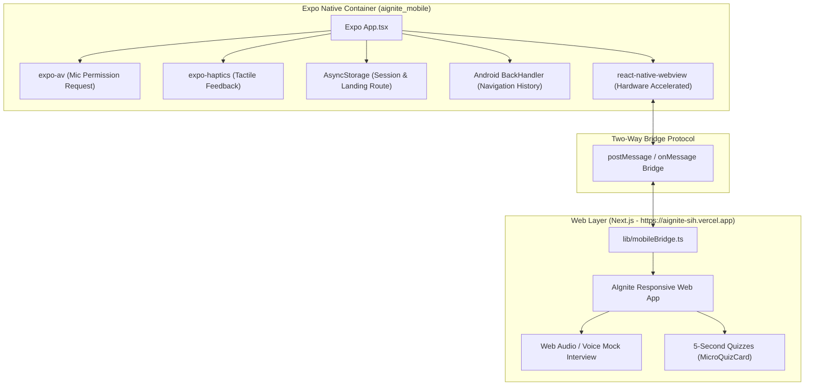

# Mobile App Architecture (React Native Expo WebView) - AIgnite
> **Project**: AIgnite (*pronounced ignite, 'A' is silent*)  
> **Mobile Technology**: Expo (React Native) with `react-native-webview`  
> **Mobile Directory**: `aignite_mobile/` (Separate clean repo/directory structure)  
> **Default Production URL**: `https://aignite-sih.vercel.app`  
> **Target Stores / Distribution**: Android APK & Google Play (AAB), iOS TestFlight / App Store  

---

## 1. Overview & Strategy

To maximize development velocity for **Smart India Hackathon 2026** while maintaining native hardware access and rapid iteration:

AIgnite's mobile companion is engineered as a **High-Performance React Native Expo WebView Shell** that remains **100% compatible with Expo Go** during development, and can produce local or cloud standalone Android APKs via EAS.

### Why this approach?
- **100% Feature Parity**: Any new games, modules, error hunters, or pipeline simulators updated in the Next.js web application immediately appear in the mobile app without requiring app store resubmissions.
- **Expo Go Compatible**: Developers and judges can instantly launch the app by scanning an Expo Go QR code on physical Android devices without needing Android Studio or native SDK compilation.
- **Native Hardware Integration**: Full access to native microphones (`expo-av`) for the Daily AI Voice Mock Interview Coach, tactile haptics (`expo-haptics`) for 5-second quiz checks, and hardware back-button history navigation.
- **Zero Monorepo Contamination**: Kept in the clean companion folder `aignite_mobile/`, preserving Vercel CI/CD pipelines and web git history.



---

## 2. Directory Structure (`aignite_mobile/`)

```text
aignite_mobile/
├── App.tsx                     # Expo WebView host, bridge handler & back button navigation
├── app.json                    # Expo configuration, Android permissions & audio plugins
├── eas.json                    # EAS configuration for standalone Android APK & AAB builds
├── package.json                # Expo SDK dependencies (expo-av, expo-haptics, webview, async-storage)
├── tsconfig.json               # Strict TypeScript configuration
└── assets/                     # App icons and adaptive launcher drawables
```

---

## 3. Bridge Communication Protocol

The web application and native Expo container communicate via bidirectional JSON messages through:
- **Web -> Native**: `window.ReactNativeWebView.postMessage(JSON.stringify(payload))`
- **Native -> Web**: `WebView.onMessage` handler in `App.tsx`

### 3.1. Message Schema
```typescript
export type MobileBridgeEvent =
  | { type: 'TRIGGER_HAPTIC'; payload: { style?: 'light' | 'medium' | 'heavy' | 'success' | 'error' | 'warning' } }
  | { type: 'SET_DEFAULT_LANDING'; payload: { path: string } }
  | { type: 'REQUEST_MIC_PERMISSION' }
  | { type: 'SHARE_REPORT_CARD'; payload: { title: string; url: string; score?: number } }
  | { type: 'OPEN_EXTERNAL_URL'; payload: { url: string } };
```

### 3.2. Web-Side Bridge Client Helper (`lib/mobileBridge.ts`)

In the Next.js project (`aignite/lib/mobileBridge.ts`):
```typescript
export function isMobileApp(): boolean {
  if (typeof window === 'undefined') return false;
  return Boolean(window.ReactNativeWebView);
}

export function sendNativeMessage(event: MobileBridgeEvent): void {
  if (typeof window !== 'undefined' && window.ReactNativeWebView) {
    window.ReactNativeWebView.postMessage(JSON.stringify(event));
  }
}

export function triggerHaptic(style: 'light' | 'medium' | 'heavy' | 'success' | 'error' | 'warning' = 'light'): void {
  sendNativeMessage({
    type: 'TRIGGER_HAPTIC',
    payload: { style },
  });
}
```

#### Example Usage in Feed Quiz:
```typescript
import { triggerHaptic } from '@/lib/mobileBridge';

// When user selects a correct quiz option:
triggerHaptic('success');

// When user selects an incorrect quiz option:
triggerHaptic('error');
```

---

## 4. Hardware Permissions & Android Configuration

### 4.1. Audio & Microphone for AI Voice Mock Interview Coach

The app needs audio recording permissions for the AI Voice Coach to capture answers and send audio tokens for scoring.

1. **Expo Config Plugin & Android Manifest** (`app.json`):
   ```json
   {
     "expo": {
       "android": {
         "package": "com.aignite.app",
         "permissions": [
           "android.permission.INTERNET",
           "android.permission.RECORD_AUDIO",
           "android.permission.MODIFY_AUDIO_SETTINGS"
         ]
       },
       "plugins": [
         [
           "expo-av",
           {
             "microphonePermission": "Allow AIgnite to access your microphone for the Daily AI Voice Mock Interview Coach."
           }
         ]
       ]
     }
   }
   ```

2. **Upfront Runtime Permission Request** in `App.tsx`:
   Using `Audio.requestPermissionsAsync()` from `expo-av` allows Expo Go to request Android system microphone permission upfront so the web app's `navigator.mediaDevices.getUserMedia()` operates seamlessly.

---

## 5. Running the App

### 5.1. Testing in Expo Go (Fastest & Zero Setup)
1. Install **Expo Go** from the Google Play Store on your Android smartphone.
2. In your terminal:
   ```bash
   cd aignite_mobile
   npx expo start
   ```
3. Scan the generated QR code in your terminal with the Expo Go app (or camera app).
4. The AIgnite app loads directly from `https://aignite-sih.vercel.app`.

### 5.2. Testing with Local Development Server
To connect the mobile app to your local Next.js server (`http://192.168.x.x:3000`) instead of production:
- In `aignite_mobile/App.tsx`, update:
  ```typescript
  const DEFAULT_PRODUCTION_URL = 'http://192.168.1.5:3000'; // replace with your local IPv4
  ```
- Run `npx expo start` and connect.

---

## 6. Generating Standalone Android APK (for SIH Judges)

When you are ready to distribute a standalone Android `.apk` installer file:

1. Install EAS CLI:
   ```bash
   npm install -g eas-cli
   ```
2. Authenticate with Expo:
   ```bash
   eas login
   ```
3. Build the preview APK:
   ```bash
   cd aignite_mobile
   eas build -p android --profile preview
   ```
4. Once the cloud build completes, download the `.apk` directly to any Android device or share the download link with evaluators.
