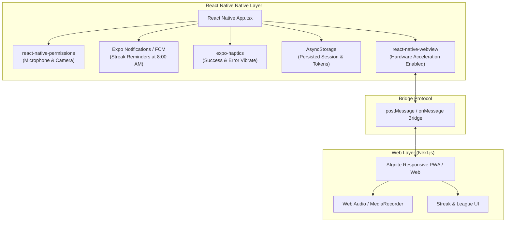

# Mobile App Architecture (React Native WebView) — AIgnite
> **Project**: AIgnite (*pronounced ignite, 'A' is silent*)  
> **Mobile Technology**: React Native / Expo with `react-native-webview`  
> **Target Stores**: Google Play Store (Android) & Apple App Store (iOS)  

---

## 1. Overview & Strategy

To maximize development velocity for **Smart India Hackathon 2026** while maintaining native hardware access, AIgnite’s mobile app is implemented as a **High-Performance React Native WebView Shell**.

This approach gives:
- **100% Feature Parity**: Any new games, modules, or simulator updates in the Next.js web app immediately appear in the mobile app without app store re-submissions.
- **Native Hardware Integration**: Full access to native microphones, push notifications (FCM / APNs) for daily streak reminders, haptic engines, and safe area insets.



---

## 2. Directory Structure (`mobile/`)

```text
mobile/
├── App.tsx                     # Entry point & WebView host
├── app.json                    # Expo / React Native configuration
├── src/
│   ├── components/
│   │   ├── LoadingScreen.tsx   # Native splash while webview initializes
│   │   ├── OfflineNotice.tsx   # Native banner when internet disconnected
│   │   └── NativeHeader.tsx    # Native notch & safe area wrapper
│   ├── bridge/
│   │   ├── messageHandler.ts   # Parses messages sent from Next.js web app
│   │   └── messageSender.ts    # Dispatches native events into webview
│   ├── hooks/
│   │   ├── usePermissions.ts   # Native Mic/Camera permission checker
│   │   └── useNotifications.ts # Registers FCM push tokens
│   └── utils/
│       └── haptics.ts          # Native vibration triggers
├── package.json
└── tsconfig.json
```

---

## 3. Bridge Communication Protocol

The web application and native container communicate via bidirectional JSON messages through `window.ReactNativeWebView.postMessage(JSON.stringify(payload))` and `WebView.onMessage`.

### 3.1. Message Schema
```typescript
interface BridgeMessage<T = unknown> {
  type: BridgeEventType;
  payload: T;
}

type BridgeEventType =
  // Web -> Native
  | 'REQUEST_MIC_PERMISSION'
  | 'TRIGGER_HAPTIC'
  | 'REGISTER_FCM_TOKEN'
  | 'SHARE_REPORT_CARD'
  | 'OPEN_EXTERNAL_URL'
  
  // Native -> Web
  | 'MIC_PERMISSION_RESULT'
  | 'FCM_TOKEN_DELIVERED'
  | 'NETWORK_STATUS_CHANGED';
```

### 3.2. Web-Side Bridge Client Helper (`lib/mobileBridge.ts`)
```typescript
export const sendNativeMessage = (type: string, payload?: any) => {
  if (typeof window !== 'undefined' && (window as any).ReactNativeWebView) {
    (window as any).ReactNativeWebView.postMessage(JSON.stringify({ type, payload }));
  }
};

// Example usage in Next.js component:
export const triggerSuccessHaptic = () => {
  sendNativeMessage('TRIGGER_HAPTIC', { style: 'success' });
};
```

---

## 4. Native Permissions Implementation (Microphone for Coach)

### 4.1. Android (`AndroidManifest.xml`)
```xml
<uses-permission android:name="android.permission.INTERNET" />
<uses-permission android:name="android.permission.RECORD_AUDIO" />
<uses-permission android:name="android.permission.MODIFY_AUDIO_SETTINGS" />
<uses-permission android:name="android.permission.CAMERA" />
```

### 4.2. iOS (`Info.plist`)
```xml
<key>NSMicrophoneUsageDescription</key>
<string>AIgnite requires microphone access for the Daily AI Interview Coach and Mock Interviews.</string>
<key>NSCameraUsageDescription</key>
<string>AIgnite requires camera access for interactive AI video mock interview evaluations.</string>
```

### 4.3. React Native WebView Implementation (`App.tsx`)
```tsx
import React, { useRef, useState, useEffect } from 'react';
import { SafeAreaView, StyleSheet, StatusBar, ActivityIndicator, View } from 'react-native';
import { WebView } from 'react-native-webview';
import AsyncStorage from '@react-native-async-storage/async-storage';
import * as Haptics from 'expo-haptics';

const BASE_URL = 'https://aignite.vercel.app';
const DEFAULT_MOBILE_PATH = '/feed'; // Instagram-style interactive AI feed by default

export default function App() {
  const webViewRef = useRef<WebView>(null);
  const [initialUrl, setInitialUrl] = useState<string | null>(null);

  useEffect(() => {
    async function loadLandingPreference() {
      try {
        const savedPath = await AsyncStorage.getItem('@user_default_landing');
        // Default to /feed for 5-10 min instant micro-learning if not explicitly configured
        setInitialUrl(`${BASE_URL}${savedPath || DEFAULT_MOBILE_PATH}`);
      } catch (err) {
        setInitialUrl(`${BASE_URL}${DEFAULT_MOBILE_PATH}`);
      }
    }
    loadLandingPreference();
  }, []);

  const handleMessage = async (event: any) => {
    try {
      const { type, payload } = JSON.parse(event.nativeEvent.data);
      switch (type) {
        // User changed default opening screen preference in Settings
        case 'SET_DEFAULT_LANDING':
          if (payload?.path) {
            await AsyncStorage.setItem('@user_default_landing', payload.path);
          }
          break;

        // Instant haptic feedback for 5-second micro-quizzes in feed
        case 'TRIGGER_HAPTIC':
          if (payload?.style === 'error') {
            Haptics.notificationAsync(Haptics.NotificationFeedbackType.Error);
          } else if (payload?.style === 'success') {
            Haptics.notificationAsync(Haptics.NotificationFeedbackType.Success);
          } else {
            Haptics.selectionAsync(); // Light tap click
          }
          break;

        case 'REGISTER_FCM_TOKEN':
          // Pass FCM push token up to Supabase
          break;
      }
    } catch (err) {
      console.error('Bridge error:', err);
    }
  };

  if (!initialUrl) {
    return (
      <View style={styles.loadingContainer}>
        <ActivityIndicator size="large" color="#6366F1" />
      </View>
    );
  }

  return (
    <SafeAreaView style={styles.container}>
      <StatusBar barStyle="light-content" backgroundColor="#0B0F17" />
      <WebView
        ref={webViewRef}
        source={{ 
          uri: initialUrl,
          headers: { 'X-Platform': 'aignite-mobile-app' }
        }}
        style={styles.webview}
        // Essential props for Audio/Video Mock Interviews & Video Feeds
        mediaPlaybackRequiresUserAction={false}
        allowsInlineMediaPlayback={true}
        javaScriptEnabled={true}
        domStorageEnabled={true}
        onMessage={handleMessage}
        // Android specific hardware permissions grant for mic
        onPermissionRequest={(request) => {
          request.grant(request.resources);
        }}
        geolocationEnabled={false}
      />
    </SafeAreaView>
  );
}

const styles = StyleSheet.create({
  container: {
    flex: 1,
    backgroundColor: '#0B0F17',
  },
  loadingContainer: {
    flex: 1,
    backgroundColor: '#0B0F17',
    justifyContent: 'center',
    alignItems: 'center',
  },
  webview: {
    flex: 1,
    backgroundColor: '#0B0F17',
  },
});
```

---

## 5. Habit Notifications & Streak Retention

To ensure high daily engagement (a core scoring metric for SIH judges):
- **Notification Schedule**: Every morning at 8:00 AM local time.
- **Message Content**:
  > 🔥 *Keep your 6-day streak alive! Today's AI question is ready: "What is the difference between LoRA and QLoRA?" Tap to record your 45-second answer.*
- **Deep Linking**: Tapping the notification deep-links straight to `/coach` or `/feed` inside the WebView.
- **Micro-Breaks Notification (Optional 2:00 PM Afternoon Nudge)**:
  > ⚡ *Got 3 minutes while standing in line? Check today's trending DeepSeek-R1 paper in AI Feed & solve a 5-second quiz.*

---

## 6. Mobile OTP Sign-In UX & Keyboard Autofill

By adopting **Supabase Email OTP login**, mobile users bypass awkward virtual-keyboard password entry:

1. **One-Tap Code Autofill**:
   - The OTP verification page in the Next.js app specifies:
     ```html
     <input 
       type="text" 
       inputMode="numeric" 
       autoComplete="one-time-code" 
       maxLength={6} 
       pattern="\d{6}" 
     />
     ```
   - Both iOS QuickType and Android keyboard automatically display the 6-digit code received via email, allowing 1-tap submission.
2. **Persistent Session Management**:
   - `react-native-webview` retains cookies across app closes via `domStorageEnabled={true}` and native cookie managers.
   - Once verified, the user remains logged in perpetually until manual sign-out, eliminating repetitive logins during daily 5-minute chores.
