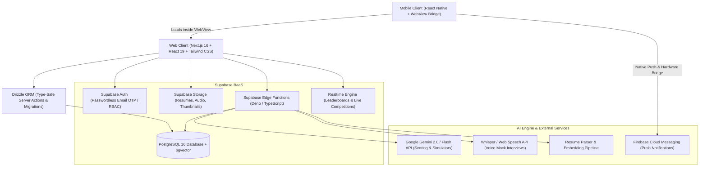

# AIgnite (pronounced *ignite*) - System Documentation
> **SIH 2026 Project | Next-Generation AI-Only Learning & Career Platform**

---

## 📌 Executive Summary

**AIgnite** (the 'A' is silent) is an AI-specialized EdTech & Recruitment platform engineered specifically for **Smart India Hackathon (SIH) 2026**.

Unlike conventional platforms that dump 50+ hours of static video tutorials on general programming, AIgnite is hyper-focused on **Applied AI, Machine Learning, Deep Learning, Generative AI, and AI Systems Architecture**. It blends:
1. **Micro-Learning & "AI Feed" (The Productive Instagram Alternative)**: Instant 5-10 minute vertical feed of bite-sized AI news, breakthroughs, and papers paired with 5-second interactive quiz checks so downtime turns into learning.
2. **Custom Mobile Entry Experience**: Mobile app defaults directly to the interactive feed for friction-free learning in lines/commutes, with customizable launch preferences.
3. **Active Hands-on Learning**: Pipeline bubble games, decision simulators, code bug fixers, and architectural sandbox labs.
4. **High-Stakes Gamification**: Duolingo-style weekly **AI Interview Leagues**, daily morning voice coach streaks, and skill badges.
5. **Automated AI Assessments**: Multi-metric **AI Interview Report Cards** evaluating knowledge, confidence, communication, and industry readiness.
6. **Direct Recruiter Pipeline**: Recruiter dashboard filtering talent based on verified badges, mock interview performance, and resume scoring.
7. **100% Free-Tier Architecture**: Built completely on zero-cost tiers (Supabase Free, Gemini 2.0 Flash Free Tier, Vercel Free, Expo/React Native, Hugging Face/Groq Free APIs).
8. **Friction-Free Passwordless Auth**: Instantaneous 6-digit Email OTP sign-in via Supabase Auth, eliminating passwords and supporting mobile keyboard autofill.
9. **Cross-Platform Access**: Web application built on **Next.js** and mobile application implemented via **React Native WebView** with native hardware integration.

---

## 📂 Documentation Directory

| Document | Description |
| :--- | :--- |
| **[PRD: Product Requirements Document](./PRODUCT_REQUIREMENTS_DOCUMENT.md)** | Detailed breakdown of all modules, Instagram-style interactive feed, student workflows, recruiter portals, and free-tier strategy. |
| **[System Design & Architecture](./SYSTEM_DESIGN.md)** | High-level and low-level system design, Next.js architecture, Supabase BaaS layout, AI news-to-quiz pipeline, and zero-cost setup. |
| **[Database Schema & Supabase Models](./DATABASE_SCHEMA.md)** | Complete PostgreSQL database schema including `feed_posts`, `feed_post_quizzes`, user launch settings, Drizzle ORM TypeScript models (`schema.ts`), RLS policies, and `pgvector`. |
| **[API & AI Edge Functions](./API_AND_EDGE_FUNCTIONS.md)** | Specifications for Supabase Edge Functions, daily automated news aggregator + quiz generator, and speech scoring. |
| **[Mobile App (React Native WebView)](./MOBILE_APP_ARCHITECTURE.md)** | Architecture for the React Native app, default launch routing to Feed, user launch preference overrides, and native permissions. |

---

## 🛠️ Technology Stack Overview

---

## 🎯 Target Milestones for SIH 2026
1. **Phase 1: Core Foundation & Auth** - Supabase setup, Next.js App Router layout, role-based navigation (Student vs. Recruiter).
2. **Phase 2: Interactive Learning Engine** - Text modules, Pipeline Bubble Game, Decision Simulator, Error Hunter MCQ.
3. **Phase 3: AI Interview Coach & Report Card** - Daily Voice Coach, Audio-based Mock Interview, automated multi-axis scoring.
4. **Phase 4: Gamification & Leagues** - Weekly AI Interview League progression, Streak tracker, Badges, Regional/Global Leaderboard.
5. **Phase 5: Recruiter Portal & Resume Analyzer** - PDF parsing, candidate search, skill gap analysis, and one-stop hiring filter.
6. **Phase 6: Mobile WebView Wrapper** - React Native shell with notifications, offline caching, and responsive UI.
