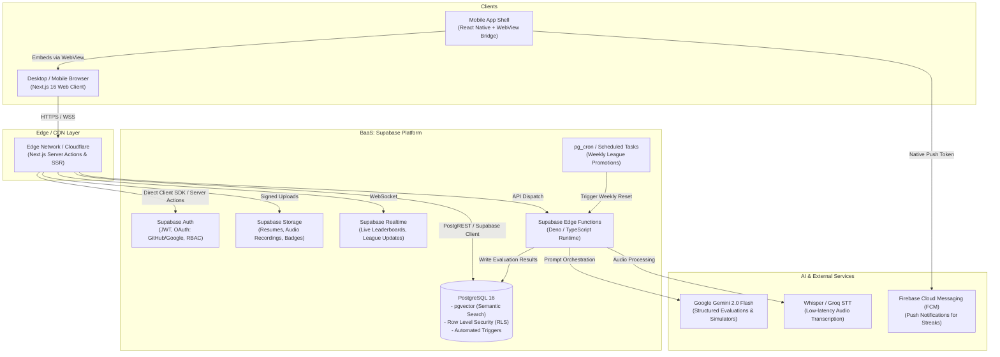
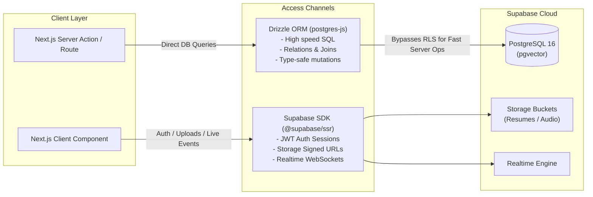
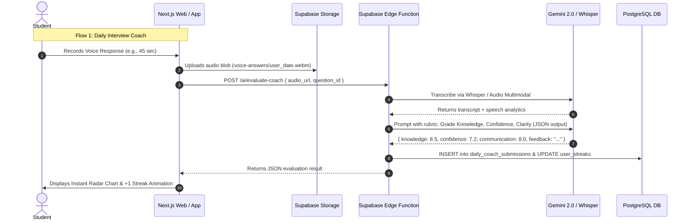
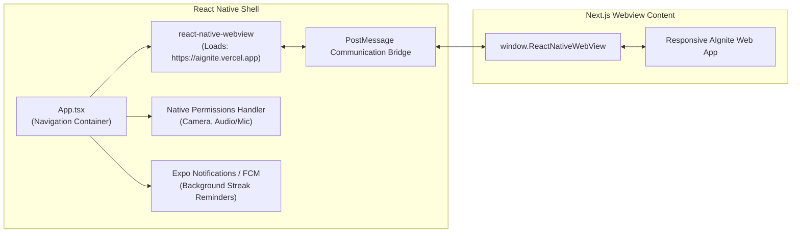

# System Design & Architecture Document — AIgnite
> **Project**: AIgnite (*pronounced ignite, 'A' is silent*)  
> **Event**: Smart India Hackathon (SIH) 2026  
> **Architecture Style**: Modern Jamstack / Serverless BaaS with Next.js App Router & Supabase

---

## 1. High-Level Architecture Overview

The system employs a client-serverless architecture optimized for high interactivity, low latency AI streaming evaluations, and cross-platform access.



---

## 2. Frontend Architecture (Next.js 16 + React 19)

### 2.1. Directory Structure Plan (`app/` Router)

```text
app/
├── (auth)/
│   ├── login/page.tsx               # Student Passwordless Email OTP request screen
│   ├── verify-otp/page.tsx          # Student 6-digit OTP verification code screen
│   ├── onboarding/page.tsx          # First-time student profile setup (University, Bio)
│   └── callback/route.ts            # Supabase token exchange & session cookie handler
├── (public)/
│   ├── page.tsx                     # Main Landing Page
│   ├── resume-analyzer/page.tsx     # Public resume uploader & ATS preview
│   ├── roadmap/page.tsx             # Interactive visual AI roadmap
│   ├── packs/                       # Company course packs showcase
│   │   ├── [packId]/page.tsx        # Google/Nvidia/OpenAI pack details
│   └── mock-preview/page.tsx        # 1-question interactive voice demo
├── (student)/
│   ├── dashboard/page.tsx           # Daily streak, league status, quick resume
│   ├── modules/
│   │   ├── [moduleId]/
│   │   │   ├── text/page.tsx        # Conceptual lesson
│   │   │   ├── bubble-game/page.tsx # Interactive RAG pipeline builder
│   │   │   ├── error-hunter/page.tsx# Code bug MCQs
│   │   │   ├── simulator/page.tsx   # Decision trade-off simulator
│   │   │   ├── lab/page.tsx         # System architect sandbox
│   │   │   └── capstone/page.tsx    # Audio/Video AI Mock Interview
│   ├── feed/page.tsx                # AIgnite Pulse: Instagram-style AI News & Micro-Quizzes (Mobile Default)
│   ├── league/page.tsx              # Weekly AI Interview League (Bronze -> Architect)
│   ├── coach/page.tsx               # Daily Morning Interview Coach (voice recorder)
│   ├── leaderboard/page.tsx         # Streak & Score leaderboards (Global & Regional)
│   └── profile/
│       ├── page.tsx                 # Public/Private Report Card & Badges
│       └── preferences/page.tsx     # Launch page settings (Feed vs Dashboard vs Coach)
├── (recruiter)/
│   ├── recruiter/
│   │   ├── login/page.tsx           # Corporate Recruiter Login
│   │   ├── apply/page.tsx           # Recruiter verification request form (Company work email)
│   │   ├── pending/page.tsx         # Quarantine holding screen ("Application Under Review")
│   │   ├── dashboard/page.tsx       # Talent overview & hiring pipeline stats (Approved only)
│   │   ├── talent-pool/page.tsx     # Filterable candidate list (by league, badge, score)
│   │   ├── candidate/[id]/page.tsx  # Detailed AI Report Card & Resume viewer
│   │   └── jobs/page.tsx            # Job postings management
├── (admin)/
│   └── admin/
│       ├── verifications/page.tsx   # Manual Recruiter Verification & Whitelisting Console
│       └── metrics/page.tsx         # SIH system telemetry & abuse monitoring
├── api/                             # Internal proxy API routes
│   ├── ai/evaluate-coach/route.ts   # Edge proxy for voice coach evaluation
│   ├── ai/resume-analyze/route.ts   # Resume parsing endpoint
│   ├── feed/quiz-answer/route.ts    # Instant micro-quiz score & streak update
│   └── webhooks/route.ts            # Supabase/Payment webhooks
├── components/
│   ├── ui/                          # Button, Modal, Card, RadarChart, Progress
│   ├── feed/
│   │   ├── FeedContainer.tsx        # Snap-scroll vertical container (Instagram style)
│   │   ├── FeedCard.tsx             # Visual diagram + 2-line breakdown
│   │   └── MicroQuizWidget.tsx      # 5-second interactive quiz with instant confetti/shake
│   ├── games/
│   │   ├── BubbleCanvas.tsx         # Interactive RAG Pipeline Game (Framer Motion / Canvas)
│   │   ├── DecisionCard.tsx         # Trade-off simulator interactive card
│   │   └── CodeEditorSnippet.tsx    # Syntax highlighted bug-hunting viewer
│   ├── audio/
│   │   ├── VoiceRecorder.tsx        # HTML5 MediaRecorder + Waveform visualizer
│   │   └── WaveformDisplay.tsx      # Real-time microphone audio visualizer
│   └── navigation/
│       ├── Navbar.tsx
│       ├── Sidebar.tsx
│       └── MobileTabBar.tsx         # Native-feel bottom navigation bar
├── lib/
│   ├── db/
│   │   ├── index.ts                 # Drizzle ORM database client (postgres-js)
│   │   └── schema.ts                # Drizzle ORM TypeScript schema models & relations
│   ├── supabase/
│   │   ├── client.ts                # Browser Supabase client (Auth, Storage, Realtime)
│   │   ├── server.ts                # Server Components / Actions Supabase client
│   │   └── middleware.ts            # Auth protection & role redirect middleware
│   └── ai/
│       ├── gemini.ts                # Google Gemini SDK instance
│       └── prompts.ts               # Structured JSON evaluation prompts
├── drizzle.config.ts                # Drizzle Kit CLI configuration
```

### 2.2. Interactive Bubble Game Engine
- **Implementation**: Built using **Framer Motion** drag-and-drop or an HTML5 Canvas component (`BubbleCanvas.tsx`).
- **Mechanics**:
  - The game receives a scenario config: e.g. Target: *"Build a Low-Latency RAG Pipeline with Document Summarization"*.
  - Available nodes float as bubbles with properties (Latency cost, Memory cost, Retrieval accuracy).
  - Learner must link valid compatible connectors (`PDF Loader` ➔ `Chunker` ➔ `Embedding` ➔ `Vector Store` ➔ `LLM`).
  - Score is calculated client-side with a cryptographic hash or validated on the server via `verifyBubblePipeline` action.

### 2.3. Dynamic Launch Page Redirection Architecture
To support the requirement of instant micro-learning in 5-10 minute downtime pockets:
1. **Device Detection**:
   - Next.js Edge Middleware checks user-agent header or custom client headers from the React Native shell (`X-Platform: aignite-mobile-app`).
2. **Preference Resolution**:
   - If user is authenticated, check `profiles.default_mobile_landing_page` (for mobile) or `profiles.default_web_landing_page` (for desktop).
   - If not authenticated or unconfigured:
     - **Mobile Client**: Automatically redirect root navigation `/` ➔ `/feed` (Instagram-style interactive feed).
     - **Desktop Client**: Navigate to `/` (Landing Showcase) or `/dashboard` (Authenticated Overview).
3. **Friction-Free Transition**:
   - The `/feed` route is pre-rendered with Server Components for sub-second LCP, hydrating instant swipe gestures and 5-second quiz taps without loading spinners.

### 2.4. Design System & Theming Architecture (OKLCH + Tailwind CSS v4)
The frontend implements the **Warm Flame** high-contrast developer design system documented in detail in [DESIGN.md](file:///d:/dev/SIH2026/aignite/DESIGN.md):
- **Color Space & Uniformity**: Fully defined in the **OKLCH** color space for perceptually linear luminance and wide-gamut reproduction. Primary brand accent is Warm Flame `oklch(0.6404 0.2153 35.9003)`.
- **Dual-Mode Theming**: Supported natively via `@custom-variant dark (&:is(.dark *))` and CSS custom property swaps between `:root` (crisp white `#FCFCFC`) and `.dark` (deep obsidian `#151515`).
- **Tailwind CSS v4 Inline Theme**: Configured with `@theme inline` in `app/globals.css`, binding semantic tokens (`--color-primary`, `--color-card`, `--color-border`, etc.) directly into utility classes without external configuration files.
- **Typography Triad**:
  - `Plus Jakarta Sans` (`--font-sans`): Primary UI, navigation, and display headers.
  - `Lora` (`--font-serif`): Narrative case studies, scenario prompts, and pedagogical explanations.
  - `IBM Plex Mono` (`--font-mono`): Code snippets, real-time telemetry, token counters, and latency displays.
- **Elevation & Radii**: Uniform container rounding (`--radius: 1.4rem`) paired with 6-stage depth shadows (`--shadow-2xs` to `--shadow-2xl`) and touch-target accessibility standards.

---

## 3. BaaS Architecture (Supabase)

### 3.1. Authentication Architecture: Dual-Track Auth & Anti-Impersonation

To prevent students from impersonating recruiters and accessing sensitive candidate resumes, AIgnite implements two completely isolated authentication pipelines:

```mermaid
sequenceDiagram
    autonumber
    actor Student as Student / Learner
    actor Recruiter as Corporate Recruiter
    participant Web as Next.js Web Client
    participant Admin as Platform Admin
    participant SupaAuth as Supabase Auth
    participant DB as PostgreSQL (RLS Protected)

    Note over Student,DB: Pipeline A: Student Instant Passwordless OTP
    Student->>Web: Enters personal/college email on /login
    Web->>SupaAuth: signInWithOtp({ email, options: { data: { role: 'student' } } })
    SupaAuth-->>Student: Sends 6-digit verification code
    Student->>Web: Inputs 6-digit OTP
    Web->>SupaAuth: verifyOtp({ email, token, type: 'email' })
    SupaAuth->>DB: Role assigned strictly as 'student' (cannot elevate)
    Web-->>Student: Enters /feed or /dashboard

    Note over Recruiter,DB: Pipeline B: Recruiter Corporate Gated Onboarding
    Recruiter->>Web: Enters corporate email & company info on /recruiter/apply
    Web->>Web: Edge check: Rejects @gmail, @yahoo, etc.
    Web->>SupaAuth: Signs up with corporate email
    SupaAuth->>DB: Inserts profile with role='recruiter', verification_status='pending'
    Web-->>Recruiter: Redirects to /recruiter/pending ("Under Review")
    Note over Recruiter,DB: Talent pool & resumes locked via PostgreSQL RLS
    Admin->>Web: Reviews application on /admin/verifications
    Admin->>DB: Sets verification_status='approved', is_verified=true
    DB-->>Recruiter: Approval Email delivered; access to /recruiter/dashboard unlocked
```

#### Anti-Impersonation & Security Enforcements:
1. **No Self-Selection**: Students cannot toggle their role to "Recruiter" in user settings or client state.
2. **Database-Level Quarantine**:
   - The PostgreSQL RLS policy on student profiles and resumes checks `auth.uid() IN (SELECT id FROM profiles WHERE role = 'recruiter' AND verification_status = 'approved')`.
   - A compromised or forged client token with `role: 'recruiter'` will still fail because `verification_status` remains `'pending'` in the database.
3. **Domain Whitelist / Blacklist Middleware**:
   - `lib/auth/domainCheck.ts` intercepts recruiter submissions and blocks all public webmail providers.

### 3.2. Data Layer: The Supabase + Drizzle ORM Hybrid Pattern
To achieve maximum type safety, sub-millisecond query execution, and rapid hackathon iteration, AIgnite implements a **Hybrid Data Access Pattern**:



#### Why Drizzle ORM over Prisma / Raw SQL:
1. **Zero Binary Overhead & Zero Cold Starts**: Drizzle is pure TypeScript with no heavy native engines (unlike Prisma which adds 300ms+ cold starts on serverless edge).
2. **`drizzle-kit push` for Rapid Hackathon Iteration**: Schema changes are defined in TypeScript (`lib/db/schema.ts`) and applied to Supabase PostgreSQL in seconds using `npx drizzle-kit push` without writing manual migrations.
3. **First-Class `pgvector` Support**: Type-safe vector distance queries (`cosineDistance(schema.resumes.embedding, targetVector)`) are executed cleanly in TypeScript.
4. **Relational Queries**: Fetching complex candidate profiles with aggregated stats, badges, and report cards in a single, type-safe call:
   ```typescript
   // lib/db/index.ts
   import { drizzle } from 'drizzle-orm/postgres-js';
   import postgres from 'postgres';
   import * as schema from './schema';

   const connectionString = process.env.DATABASE_URL!;
   // Disable prefetch as it is not supported for Transaction Pooler
   const client = postgres(connectionString, { prepare: false });
   export const db = drizzle(client, { schema });
   ```

### 3.3. Supabase Storage Buckets
1. `resumes`: Protected bucket for candidate resume PDFs (accessible only by student owner and verified recruiters).
2. `voice-answers`: Protected bucket storing `.webm` / `.mp3` recordings of daily coach answers and mock interviews.
3. `badge-assets`: Public CDN bucket for SVGs and badges.

---

## 4. AI Evaluation Pipelines



### 4.1. Voice Interview Scoring Engine
- **Audio Capture**: Browser `MediaRecorder` API captures audio in `audio/webm;codecs=opus`.
- **Speech Metrics Analyzed**:
  1. **Transcription**: Extracted via Gemini 2.0 Multimodal Audio or Whisper.
  2. **Filler Words Counter**: Deterministic regex counting instances of "um", "uh", "like", "you know", "actually".
  3. **Pacing & Duration**: Words per minute (WPM) calculation (ideal range: 130–160 WPM).
  4. **Conceptual Accuracy**: Graded against canonical ground truth vectors stored in `interview_questions`.

### 4.2. Resume Analyzer Pipeline
1. User uploads `resume.pdf`.
2. Extracted text is fed into a structured Gemini prompt:
   - Identifies candidate's technical skills, projects, and educational background.
   - Computes ATS match score based on current industry job market benchmarks.
   - Evaluates missing topics in 5 AI verticals (GenAI, ML, DL, CV, NLP).
   - Generates pgvector 768-dim embedding of candidate skill profile.
3. Saved to `resume_evaluations` table for recruiter querying.

### 4.3. AI News & Micro-Quiz Generation Pipeline (Zero-Cost Free Tier)
To supply fresh, engaging content every day without manual editorial overhead:
1. **Source Ingestion**:
   - Supabase Edge cron runs daily at 04:00 UTC, fetching top trending papers from Hugging Face Daily Papers and ArXiv RSS (completely free public endpoints).
2. **AI Synthesis (Gemini 2.0 Flash Free Tier)**:
   - For each paper/breakthrough, Gemini extracts:
     - 1 punchy title ($<10$ words)
     - 2-sentence executive summary focused on architectural impact
     - 1 key architectural takeaway
     - **1 Instant 5-Second Micro-Quiz**: 1 targeted question with 3 options, 1 correct index, and a 1-sentence instant explanation.
3. **Database Insertion**:
   - Rows inserted directly into `feed_posts` and `feed_post_quizzes`.
   - Users who answer correctly on their mobile feed receive immediate confetti, $+5$ league points, and streak affirmation.

---

## 5. Mobile App Architecture (React Native WebView Shell)



### 5.1. JS-to-Native Bridge Specifications
- **Audio / Mic Permission Handshake**:
  - The WebView configures `allowsInlineMediaPlayback={true}` and handles Android `onPermissionRequest` to grant microphone access for voice coaching.
- **Push Notification Registration**:
  - React Native receives device FCM token upon launch.
  - Passes token to WebApp: `window.ReactNativeWebView.postMessage(JSON.stringify({ type: 'REGISTER_FCM_TOKEN', token }))`.
  - Next.js stores token in `user_profiles.fcm_token` to schedule morning 8 AM streak reminders.
- **Haptic Feedback**:
  - Triggered on bubble connects, streak completion, or league promotions via bridge message `{ type: 'HAPTIC_SUCCESS' }`.

---

## 6. Gamification & League Promotion Engine

### 6.1. Tier Hierarchy
- **Tier 1**: Bronze AI Engineer (`tier_level: 1`)
- **Tier 2**: Silver AI Engineer (`tier_level: 2`)
- **Tier 3**: Gold AI Engineer (`tier_level: 3`)
- **Tier 4**: LLM Master (`tier_level: 4`)
- **Tier 5**: AI Architect (`tier_level: 5`)

### 6.2. Weekly Cron Workflow (Supabase `pg_cron` / Edge Function)
```sql
-- Runs every Sunday at 23:59:59 UTC
SELECT cron.schedule(
    'process-weekly-league-promotions',
    '59 23 * * 0',
    $$
    SELECT net.http_post(
        url:='https://<project-ref>.supabase.co/functions/v1/process-league-promotions',
        headers:='{"Content-Type": "application/json", "Authorization": "Bearer <SERVICE_ROLE_KEY>"}'::jsonb
    ) as request_id;
    $$
);
```
- **Promotion Logic**:
  - Groups students into leaderboards of 30 within their tier.
  - **Ranks 1 - 5 (Top ~17%)**: Promoted to next Tier.
  - **Ranks 6 - 24 (Middle ~63%)**: Retain current Tier.
  - **Ranks 25 - 30 (Bottom ~20%)**: Demoted to previous Tier (except Bronze).
  - Rewards promotional achievement badges and triggers in-app celebration splash.

---

## 7. Security, Privacy & Performance

1. **Row Level Security (RLS)**:
   - Mandatory on 100% of tables. No client can query or mutate rows belonging to another `auth.uid()` unless explicitly permitted by recruiter view policies.
2. **Anti-Cheat Mechanics for League & Challenges**:
   - Audio recordings must be unique (SHA256 fingerprint check to avoid reusing audio).
   - Time-delta validation between question delivery and submission.
3. **Optimized Asset Delivery**:
   - Next.js `Image` component with WebP/AVIF compression.
   - SVG vector assets for badges.
   - Edge-cached static content for roadmap and course pack overviews.

---

## 8. Zero-Cost / 100% Free-Tier Architecture Blueprint

Every component in the AIgnite technical stack is specifically selected to operate **100% free of cost** for development, staging, and competition presentation:

| Service / Layer | Technology | Free Tier Allocation | How AIgnite Stays Within Free Limits |
| :--- | :--- | :--- | :--- |
| **Frontend Hosting** | Vercel Hobby Tier | Unlimited edge requests, 100 GB bandwidth, free SSL. | Next.js SSG + ISR caches static lesson notes and roadmaps. |
| **BaaS & DB** | Supabase Free Tier | 500 MB DB, 50k MAU, 1 GB Storage, 500k Edge Function calls/mo. | Audio clips compressed to Opus 32kbps (~120KB per 45s answer). Resumes capped at 2MB. |
| **AI LLM Engine** | Google Gemini 2.0 Flash (Free API) | 15 RPM, 1,000,000 TPM, 1,500 RPD via Google AI Studio. | Responses cached by prompt hash; client rate-limiting protects against abuse. |
| **Speech Transcription** | Groq Cloud Whisper / Web Speech API | Ultra-fast Whisper large-v3 free tier + browser-native Web Speech API. | Zero cloud costs; client-side STT backup fallback. |
| **Mobile Shell** | React Native + Expo | 100% Open Source, free local EAS builds, Expo Go testing. | No developer fees required for testing on physical devices. |
| **Vector DB** | PostgreSQL `pgvector` | Included free in Supabase PostgreSQL. | No need for paid Pinecone or Weaviate clusters. |
| **AI News Sources** | ArXiv API & Hugging Face Papers | Open, free public APIs without authorization fees. | Daily batch cron pulls once every 24 hours. |
| **Email OTP Delivery** | Resend Free Tier / Supabase Mailer | 3,000 free emails/mo (100 emails/day) via Resend or Supabase built-in SMTP. | Zero-cost OTP email delivery with instant delivery (<1s). |
